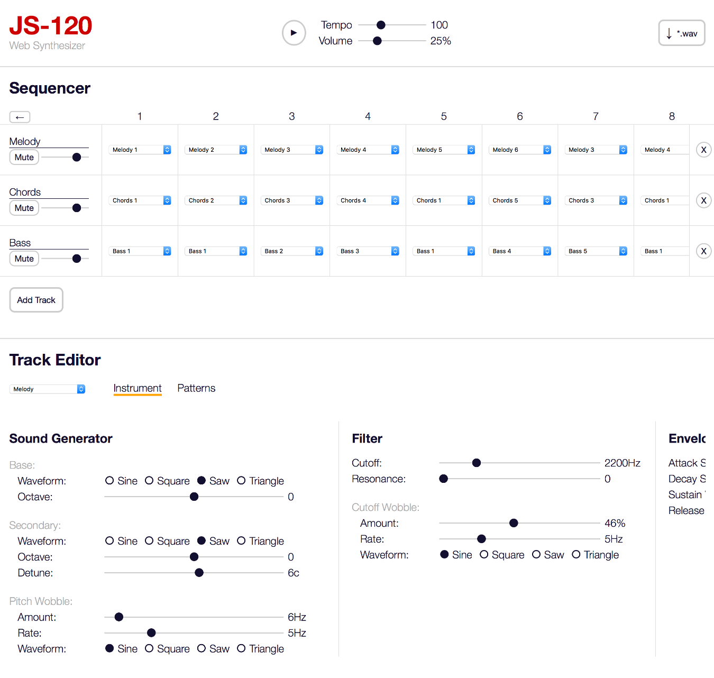

# JS-120

A synthesizer and sequencer that runs in your browser, using the WebAudio API.

Try it out here: [http://www.joelstrait.com/js-120](http://www.joelstrait.com/js-120)

## Features

* Sound generator
  * Base oscillator with sine/square/saw/triangle wave
  * Secondary oscillator with same wave types, and optional detune from primary oscillator
  * LFO (i.e. "pitch wobble")
  * Filter
  * Envelope for base+secondary osciallators
* Sequencer
  * Multiple tracks
  * Different sound generator controls for each track
  * Different set of patterns (16 steps long) for each track
  * Full songs 8 patterns long (i.e. 128 steps)
* Tempo control
* Volume control
* Download sequencer output to a *.wav file
